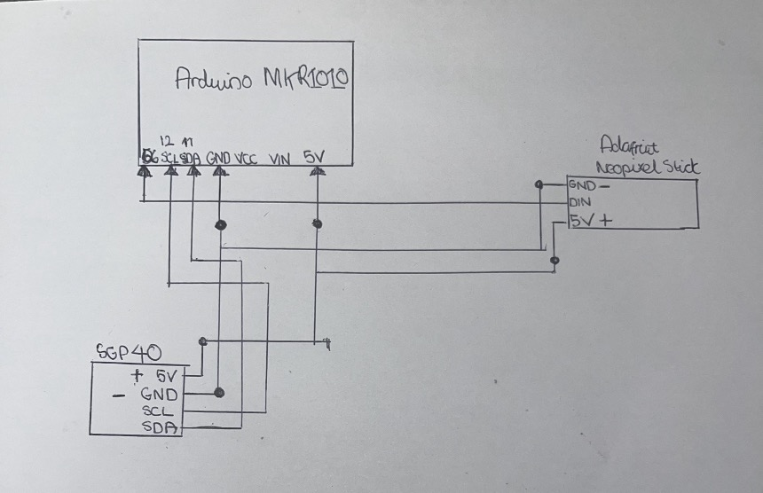
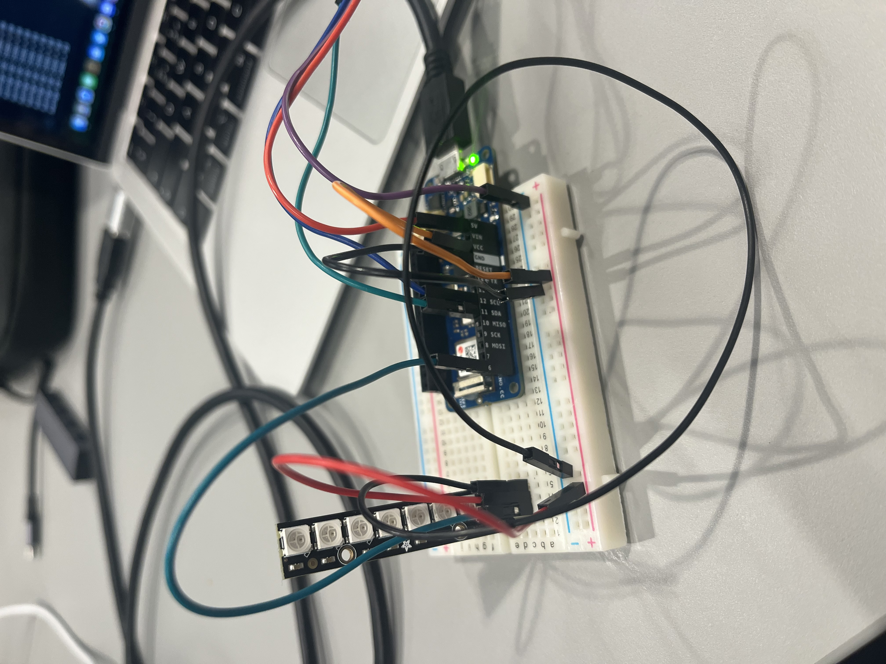
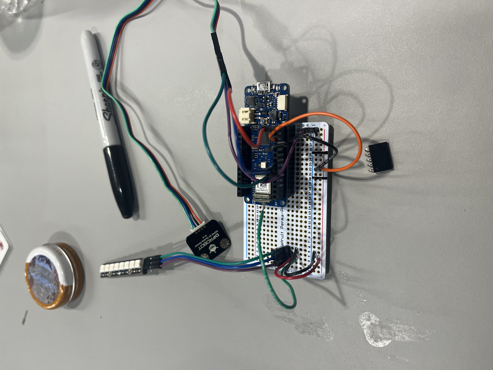
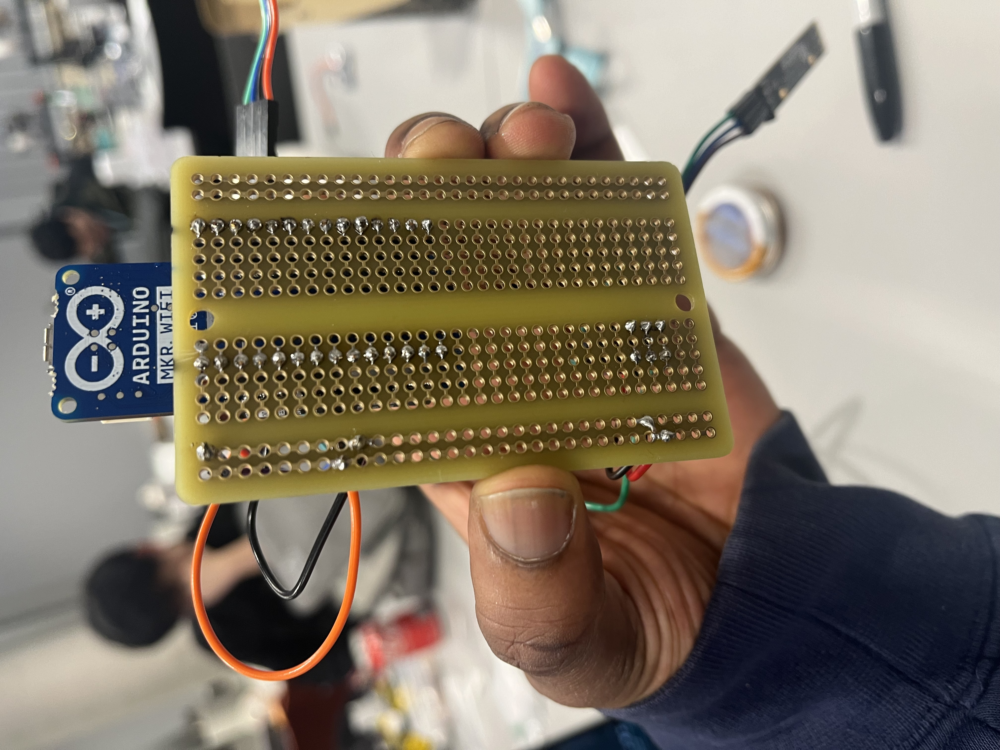
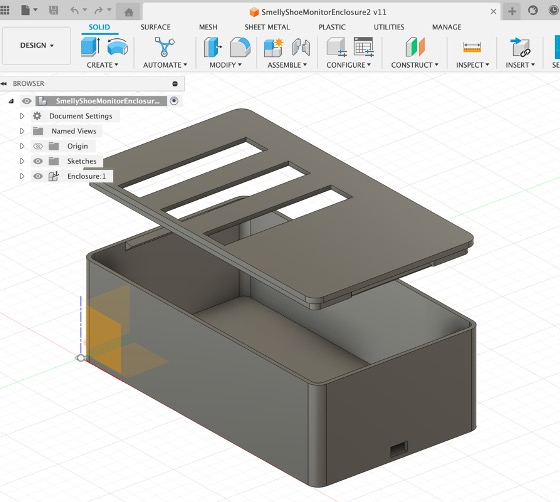
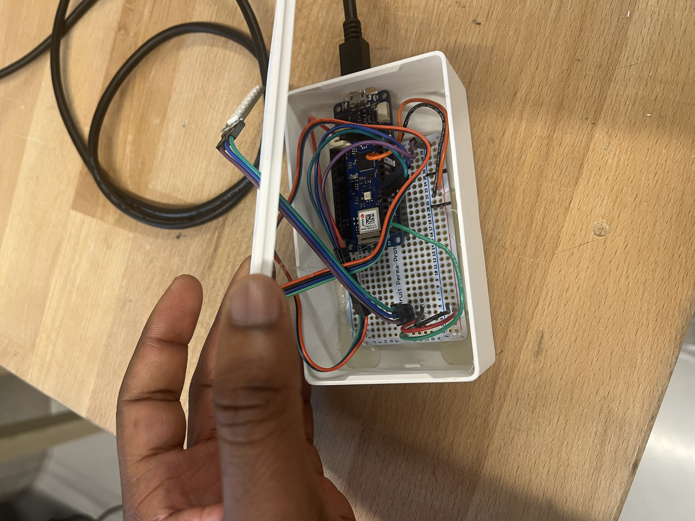
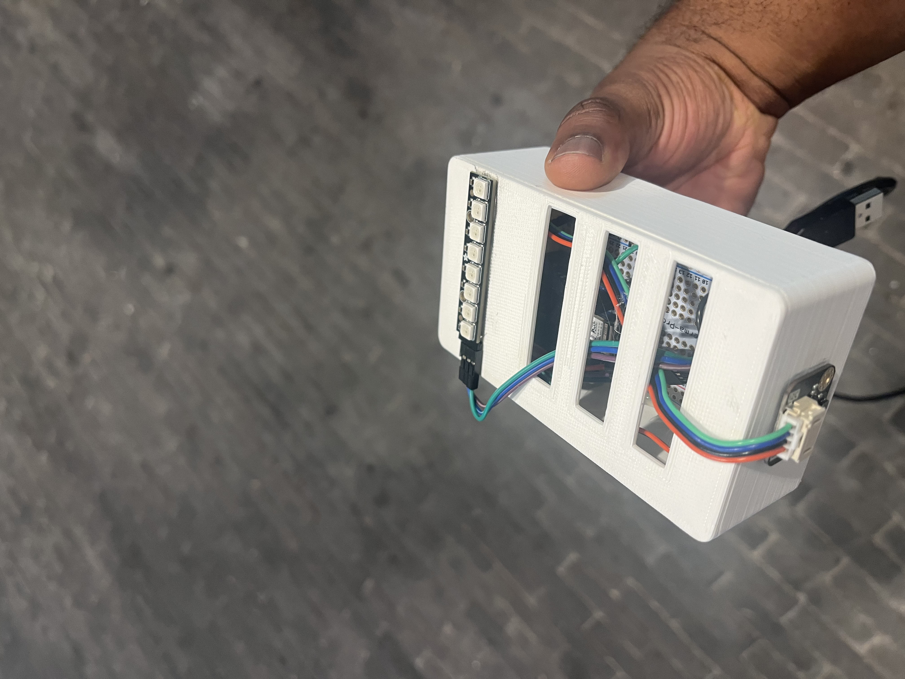
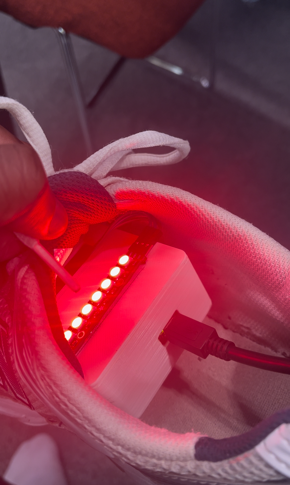

CASA0016
# SmellyShoeMonitor

## What is the Smelly Shoe Monitor?
The SmellyShoeMonitor is a simple device that measures the VOC content inside a shoe. It uses LEDs to visually inform the user how bad their shoes smell based on the value of VOCs detected.

## Components Purchased
MICS6814 -Unused - https://thepihut.com/products/mics6814-3-in-1-gas-sensor-breakout-co-no2-nh3
SGP40 - https://thepihut.com/products/gravity-sgp40-air-quality-sensor
Protoboard - https://thepihut.com/products/adafruit-perma-proto-quarter-sized-breadboard-pcb-single?srsltid=AfmBOorRmKs3jUHScMp9pJwDNw6Zg0gd9OXI9FJNxFOESFnTfcRrc8zK

## Overall Development 

### 1 - Circuit Schematic

- Final Schematic after dropping 2nd sensor 
- *Last Minute Sensor?
- Possible battery use?
- *Shared GND and 5V pins, use power rails +extra wires

### 2 - First Circuit 

- Pretty Quick to put together no major struggles

### 3 - First Protoboard

- Easy to replicate circuit from breadboard

### 4- Soldering

-Noticed it has the same connections as breadboard
-Circuit working fine when tested after soldering
-Luckily no desoldering 

### 5 - Fusion

- Familiar with Box
- Taught how to fillet box by Andy
- Snapfit lid tutorial so lid did not become loose

### 6 - Circuit Inside Enclosure

- Superglued in, couldnt drill hole and screw in due to material
- Had to file hole for Arduino USB, miscalculated size in Fusion

### 7 - Final Device

- Light at the end of the tunnel

### 8 - Device in Action

- *Don't use this shoe in final crit, find cleaner one

## Sources - Format necessary to Harvard in report

https://www.youtube.com/watch?v=VVmOtM60VWw

https://learn.adafruit.com/adafruit-neopixel-uberguide/arduino-library-use

https://bitbucket.org/pernixia/arduinopimmics6814/src/master/

https://dfimg.dfrobot.com/nobody/wiki/518e5e0e1bfa8fdf441c96f0a3d093ad.pdf

https://docs.arduino.cc/learn/communication/wire/

https://github.com/ucl-casa-ce/casa0014/blob/main/chronoLumina/mkr1010neopixelstrip/mkr1010neopixelstrip.ino

https://uk.pinterest.com/pin/738731145157125952/

https://github.com/eNBeWe/MiCS6814-I2C-Library/commit/43f8441ce9a3c3f2bb07ad50e4536cead32e9078

https://pubmed.ncbi.nlm.nih.gov/21790661/

